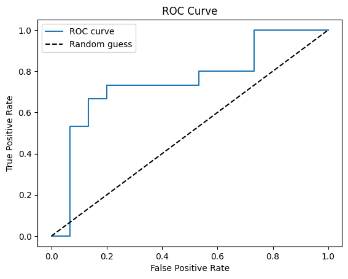

# Surveillance Camera Fight Detection
This project aims to detect fights in surveillance camera videos using a CNN + LSTM model trained on the Fight Detection Surveillance Dataset. We used a pretrained CNN InceptionV3 as the backbone for our model and optimized the hyperparameters of the LSTM.

## Description
Surveillance cameras are a common feature in public places such as malls, public transport, and night clubs. However, monitoring these cameras in real-time is a daunting task, especially in large facilities with numerous cameras. This is where our project comes in. By automatically detecting fights in surveillance camera footage, our system can alert security personnel to violent incidents as soon as they occur.

The model consists of a pretrained InceptionV3 CNN, followed by a 2-layer LSTM. The layers of the CNN were frozen due to the small dataset, and the hyperparameters of the LSTM were optimized. Various models with data augmentation were also tried to improve performance. Part of the code used was replicated from https://github.com/SBoyNumber1/LSTM-video-classification and then modified to cater to this specific problem.

## Installation
To install the necessary dependencies for this project, run the following command:

`pip install -r requirements.txt`

We recommend using Google Colab to run this project, as that is where it was tested. If you choose to use Google Colab, you can skip the above step and simply upload the project files to a Google Drive Repository.


## Fight detection using InceptionV3 + LSTM:
### Training

Surveillance Camera Fight Detection using a pretrained InceptionV3 base model + a LSTM architecture.
This is a guide on how to execute it in Google Colab

1. Open the InceptionV3-LSTM.ipynb file in Google Collab
2. Connect to your Google Drive repository by executing the following code:

```
from google.colab import drive
drive.mount('/content/drive') 
```
2. Check that the data/data_og folder has the following structure

>	fight
> >		fi001.mp4
> >		fi002.mp4
> >		...
>	noFight
> >		nofi001.mp4
> >		nofi002.mp4
> >		...

3. Extract images in `.jpg` format from video with script extract_files.py. Pass video files extenssion as a param

`	$ python extract_files.py mp4`


4. Check the data_file.csv and choose the acceptable sequence length of frames. It should be less or equal to lowest one if you want to process all videos in dataset. We recommend a length of 20 frames in order to use all the videos.

5. Resize the videos to 299 x 299 pixels, the input shape of InceptionV3.
9. Extract the sequence for each video with InceptionV3 and train the LSTM. Run train.py script with sequence_length, class_limit, image_height, image_width args

`	$ python train.py 20 2 299 299`

10. Check your best model in the data/checkpoints/ folder. It should be the latest saved.
11. Evaluate your model using predict.py. It will generate an .xlsx with the confusion matrix and the predictions for each video.

`	$ python predict.py 20 2 299 299`

12. Use clasify.py script to clasify your video. Args sequence_length, class_limit, saved_model_file, video_filename

`	$ python clasify.py 75 2 lstm-features.hdf5 video_file.mp4`

This will create a new video that shows the classification result in the root folder.

### Development
The hyper parameters of the LSTM were optimized in order to reach the best performance. The following code was edited several times to change the number of neurons in the LSTM and Dense layers, as well as the Dropout.

```
model = Sequential()
        model.add(LSTM(2048, return_sequences=False,
                       input_shape=self.input_shape,
                       dropout=0.5))
        model.add(Dense(512, activation='relu'))
        model.add(Dropout(0.5))
        model.add(Dense(self.nb_classes, activation='softmax'))
```
### Results

Although many models were tested, only the 3 most interesting will be discussed. The parameters studied are a different size of the LSTM layer and a second fully connected dense layer. Apart of these cases, we try to add an additional layer completely connected to improve the summary of the characteristics. Different dropout values ​​have also been tested, but due to overlearning it suffered, it had to be increased to 0.5, with which the best results have been obtained. Finally, different batch sizes have been tested to try to explore different solutions forcing them to learn faster or slower. They are presented in the following table:

| Model | # LSTM neurons | # Dense_1 neurons | # Dense_2 neurons | # Dropout | Batch size |
|-------|----------------|-------------------|-------------------|-----------|------------|
| A     | 2048           | 512               | -                 | 0.5       | 8          |
| B     | 128            | 64                | -                 | 0.5       | 8          |
| C     | 128            | 64                | -                 | 0.5       | 1          |

The next table presents the results for each model:

| Model | Train Acc | Train F-1 | Train Precision | Train Recall | Test Acc | Test F-1 | Test Precision | Test Recall |
|-------|-----------|-----------|-----------------|--------------|----------|----------|----------------|-------------|
| A     | 0.87      | 0.88      | 0.82            | 0.94         | 0.70     | 0.71     | 0.68           | 0.73        |
| B     | 0.83      | 0.82      | 0.87            | 0.78         | 0.70     | 0.64     | 0.80           | 0.53        |
| C     | 0.78      | 0.77      | 0.80            | 0.73         | 0.77     | 0.70     | 1.00           | 0.53        |

Finally, the ROC curves of the 3 models were plotted:

#### ROC Curve Model A

#### ROC Curve Model B

#### ROC Curve Model C


#### Data Augmentation

The size of our dataset is 300 videos, half of them from the fight class and the second half from noFight. The dataset has been separated into 210 videos for training, 30 videos for testing and 60 for validation. To increase the training set, flip transformations, rotation, change of light intensity, contrast and add noise were performed to increase the dataset size by a factor of 4. In this case the data augmentation process has been a little different than usual, since the same transformation had to be applied to all the frames of the same video.  


# Saved models

The weights of the models trained by us is too big to upload to Github. If you wish to use it contact us
